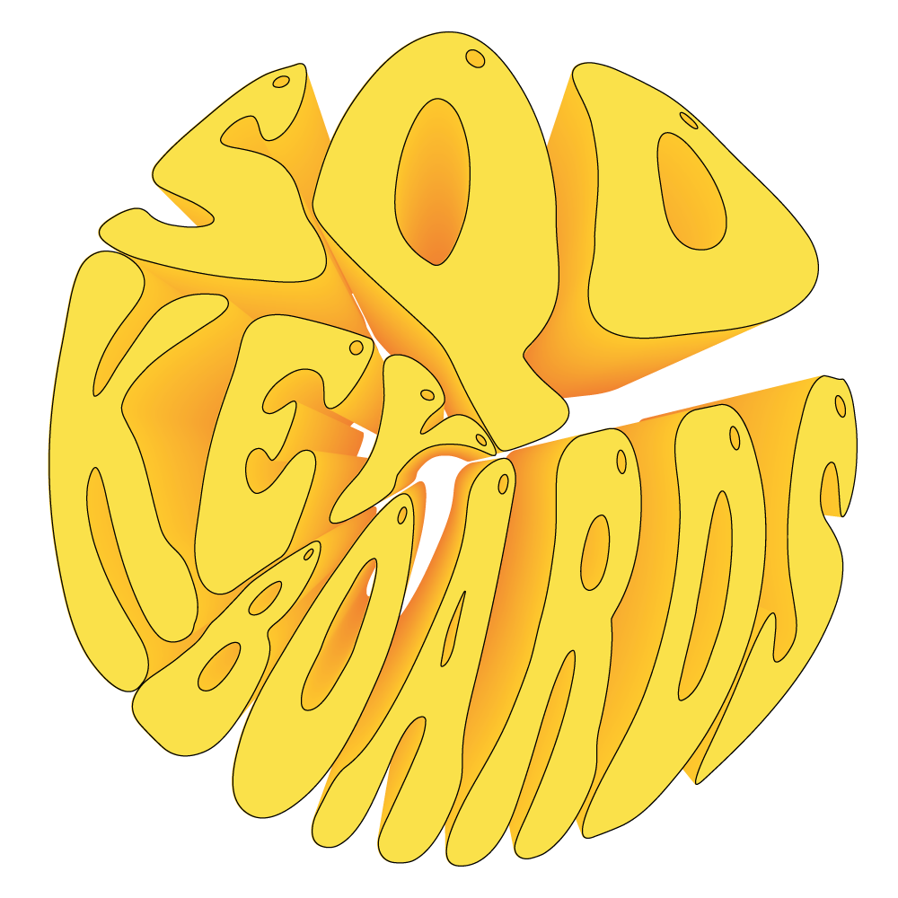

  

Links: <a href="#status">status</a>

# SQD Keyboards
We sell keyboards! A project, run by two cousins in honor of satisfaction because of *quality custom keyboard* usage experience!  
  
Being a coder means doing a lot of stuff with your keyboard. Have you ever noticed annoying sound or feeling after long hours of typing? We have! And later we understood, that you need your very own, non-massmarket keyboard, that will satisfy all your requirements!  
  
That's why we are here! With our configurator (**WIP**), you will be able to create, observe and hear you keyboard right away after configuring it virtually. Doesn't that sound fascinating?  
  
Have fun and stay safe and sound. ♥

# Status
**Our resource is highly WIP right now.** We've just finished making the title page and are starting to design the configurator. Another good news is we just obtained or very own custom domain. From now on, you can acess us via comfortable [link](https://sqd-keyboards.xyz) (https://sqd-keyboards.xyz), which features Cloudflare DNS and security certificates!  
  
At the moment, you can watch the repository so you recieve updates on it. *We will move to branch "web" immediately, whenever the project is ready for production.*  
  
Thanks to everyone for support and following us!
